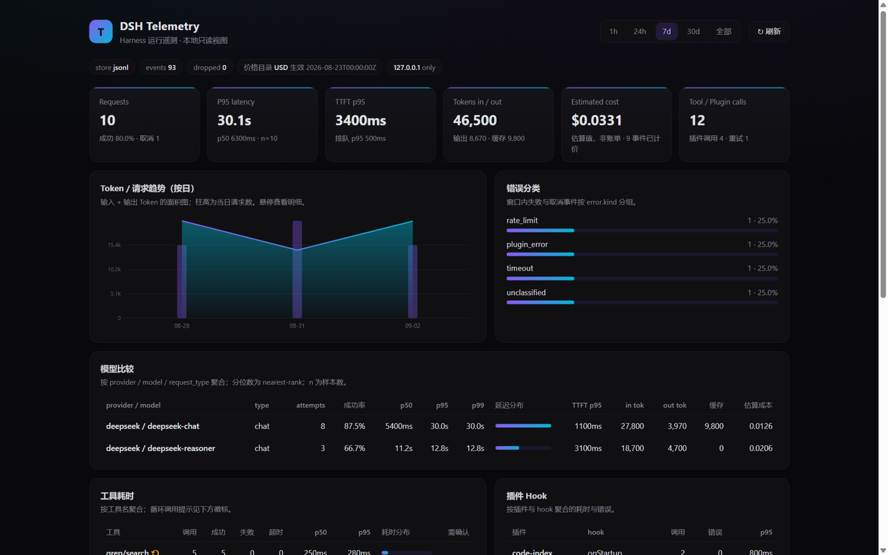
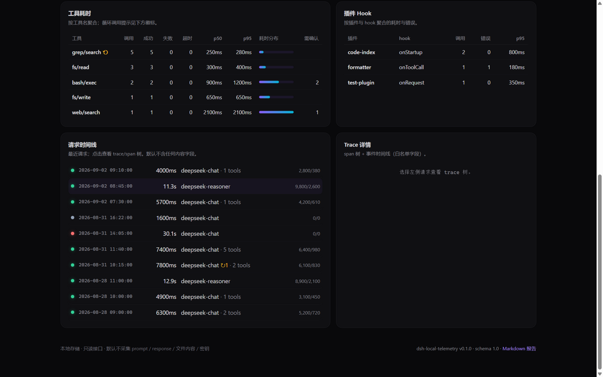
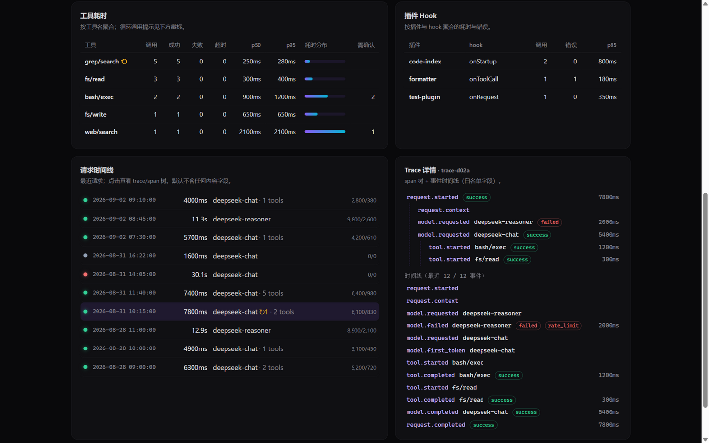

# dsh-telemetry

English | [简体中文](README.zh-CN.md)

[](LICENSE)
[](https://github.com/topics/dsh-plugin)
[](https://github.com/duyanta123/dsh-telemetry/actions/workflows/ci.yml)
[](https://www.npmjs.com/package/dsh-local-telemetry)
[](CHANGELOG.md)

A local-first Harness telemetry plugin: records request, model, tool, and plugin lifecycle metrics (latency, tokens, cost, errors, cache) — no conversation content collected by default.

> The npm package is named `dsh-local-telemetry` (the `dsh-telemetry` name on npm is taken by a third party); the GitHub repository remains `dsh-telemetry`. Both refer to the same project.

## Positioning

dsh-telemetry is a Harness runtime observability plugin. It does not do business analysis, does not modify request content, and does not upload user conversations to any third-party platform.

It answers:
- How long did a request take?
- Where did the time go — model, tool, plugin, or queuing?
- What are the input/output token counts and retry costs?
- Which tool calls are slowest and most failure-prone?
- Which plugins throw exceptions or block?
- Is the cache hitting, and is model routing saving cost?
- Are there oversized contexts, tool-call loops, or abnormal retries?

One-line positioning:

> Make Harness behavior measurable without collecting sensitive conversation content by default.

## UI Preview

**Dashboard overview** — requests, P95 latency, time-to-first-token, tokens/cache hits, estimated cost (computed automatically once a price catalog is configured), and error classification. Every metric is annotated with its sample count and can be recomputed from raw events:



**Tool & plugin timing** — loop-call ⚠ warnings, counts of calls requiring user confirmation, and plugin hook error statistics; the request timeline below uses status dots for success/failure/cancel, with ↻ marks on retried requests:



**Trace details** — click any request to expand its span tree and event timeline; the screenshot below shows the full chain of deepseek-reasoner hitting rate_limit and falling back to deepseek-chat successfully (each attempt timed independently):



> All screenshots show the local read-only Web UI (`--ui`, bound to 127.0.0.1 only) with a demo dataset; by default no prompt / response / file content / secrets are collected.

## Installation

As a DSH plugin (recommended):

```bash
dsh plugin --profile web add "github:duyanta123/dsh-telemetry#main"
```

Compatibility tiers: JSONL and pure CLI capabilities run standalone on Node.js >= 18; the SQLite backend requires Node.js >= 22.5; as a DSH 0.1.5-rc.2 plugin it is verified with Node.js >= 22.19. Run `npm run test:compat` to execute an isolated-profile add, dump-config, and startup smoke test.

Or install from npm (as a library or standalone CLI):

```bash
npm install dsh-local-telemetry
```

After installation, restart `dsh --profile web`; the `telemetry-runbook` skill then guides the query CLI:

```bash
node bin/telemetry.mjs --status
node bin/telemetry.mjs --summary --since 24h
node bin/telemetry.mjs --trace <trace_id>
node bin/telemetry.mjs --ui --port 47610
```

## Quick Start

### 1. Use as host integration code

Events come in through an explicit adapter (currently the only recommended way):

```js
import { createRecorder } from 'dsh-local-telemetry/telemetry';

const recorder = createRecorder({
  config: {
    path: '~/.dsh/telemetry',
    capture_metadata: 'safe', // default 'none': no content collected
    hash_names: false,
    sample_rate: 1,
    errors_always_sample: true,
    slow_request_ms: 10000,
    retention_days: 7,
  },
});
await recorder.start();

// Record an event (missing id and timestamp are filled in automatically)
recorder.record({
  event: 'model.completed',
  trace_id: 'trace-001',
  span_id: 'span-003',
  parent_id: 'span-001',
  timestamp: '2026-08-23T12:00:00.000Z',
  model: { provider: 'deepseek', name: 'deepseek-chat', request_type: 'chat' },
  usage: { input_tokens: 4200, output_tokens: 860, cached_input_tokens: 0, reasoning_tokens: null },
  result: { status: 'success', finish_reason: 'stop' },
});

// Flush before exit; failures never block exit
await recorder.close();
```

### 2. Aggregate reads (referenced by higher-level plugins)

```js
import { openStore, aggregateEvents, buildTraceView } from 'dsh-local-telemetry/telemetry';

const store = await openStore({ store: 'jsonl', path: '~/.dsh/telemetry' });
const { events } = await store.readEvents({ fromMs: Date.now() - 3600e3 });
const summary = aggregateEvents(events, { catalog: null });

console.log(`P95 latency: ${summary.requests.latency.p95}ms, Input tokens: ${summary.tokens.input}`);
```

### 3. Invoke via the DSH skill (the skill guides the CLI)

```bash
node bin/telemetry.mjs --summary --since 1h --group-by model
node bin/telemetry.mjs --export TELEMETRY-REPORT.md --since 7d --format markdown
node bin/telemetry.mjs --purge --before 30d
node bin/telemetry.mjs --ui --port 47610
```

## CLI Options

| Option | Default | Description |
| --- | --- | --- |
| `--store jsonl\|sqlite` | jsonl | Storage backend (sqlite requires Node ≥22.5) |
| `--path <dir>` | ~/.dsh/telemetry | Data directory |
| `--config <file>` | - | Config file |
| `--since <duration\|ts>` | - | Window start (e.g. 1h / 7d / ISO timestamp) |
| `--until <duration\|ts>` | - | Window end |
| `--profile <name>` | - | Filter by profile |
| `--model <name>` | - | Filter by model |
| `--plugin <name>` | - | Filter by plugin |
| `--event <name\|prefix.*>` | - | Filter by event (e.g. model.*) |
| `--group-by <key>` | - | Group by: model\|plugin\|tool\|profile\|day |
| `--format text\|json\|markdown` | text | Output format (`--export` infers from the `.json`/`.md` extension when unspecified) |
| `--errors-only` | - | Show errors and cancels only |
| `--slow-over-ms <N>` | - | Show requests taking ≥ N ms only |
| `--sample-rate <0..1>` | - | Sampling rate (recorder-side config) |
| `--capture-metadata none\|safe` | - | Metadata capture (recorder-side config) |
| `--purge --before <d>` | - | Retention cleanup |

## Privacy & Security

- **No content by default**: prompts, responses, file contents, command arguments, environment variables, and secrets are never collected.
- **Sanitization**: sensitive keys (Authorization, Cookie, token, password, api_key, etc.) are dropped whole; URL credentials and query tokens are redacted; absolute paths can be reduced to basenames or hashes.
- **Name hashing**: tool, plugin, model, and profile names can be hashed — stable but not directly reversible.
- **Local storage**: defaults to `~/.dsh/telemetry` (JSONL files per day, optional SQLite); no network access.
- **Read-only UI**: `--ui` binds to 127.0.0.1 only and never exposes to the LAN by default.

## Troubleshooting

**`--store sqlite` fails to start?**
The SQLite backend relies on the built-in `node:sqlite`, which requires Node >= 22.5. Check with `node --version`, or switch to the default JSONL backend (Node >= 18 suffices).

**Web UI unreachable, or the port is taken?**
`--ui` binds to `127.0.0.1` only (by design, never exposed to the LAN); access remote machines through an SSH tunnel. If the default port 47610 is taken, change it with `--port`.

**Cost shows as null in summaries?**
Cost = token usage × price catalog. Without a catalog (`--config` or `prices.json` in the data directory), cost is recorded as missing (null, not 0) and can be recomputed for past events once configured; see [docs/schema.md](docs/schema.md) for field semantics.

**`--status` says collection is not active?**
On config parse failure the recorder degrades to disabled (fail-open, a safe default) — check the config file syntax and field names. JSONL events are written per-day under `~/.dsh/telemetry`; confirm today's file exists there.

**Old sessions won't open after upgrading the DSH host to 0.1.5.x?**
The Session format V3 migration is irreversible and is host behavior; back up session logs before upgrading the host (see the 0.1.2 entry in [CHANGELOG.md](CHANGELOG.md)).

## Documentation

- [docs/configuration.md](docs/configuration.md) — config file, field tables, sanitization rules, resource budgets, price catalog format
- [docs/schema.md](docs/schema.md) — event contract schema version 1.0, 12 event types and field constraints
- [examples/telemetry.json](examples/telemetry.json) / [examples/prices.json](examples/prices.json) — config samples
- [CHANGELOG.md](CHANGELOG.md) — release notes
- [DSH-TELEMETRY-开发计划.md](DSH-TELEMETRY-开发计划.md) — design and iteration history

## Versions & Roadmap

- **v0.1.0 (released)**: local JSONL + optional SQLite (built-in `node:sqlite`, Node ≥22.5), request/model/tool/plugin base events, start/stop config, fail-open, `--status`/`--summary`/`--trace`/`--export`/`--purge`/`--ui`, no content by default, sampling and retention policies, price catalog and sanitization, Markdown reports, trace/span tree and timeline views.
- **v0.1.1 / v0.1.2 (released)**: `npm run test:compat` compatibility gate and three-tier compatibility notes; DSH host baseline migrated to `0.1.5-rc.2` (zero plugin code changes).
- Future iterations follow [DSH-TELEMETRY-开发计划.md](DSH-TELEMETRY-开发计划.md).

## License

MIT
